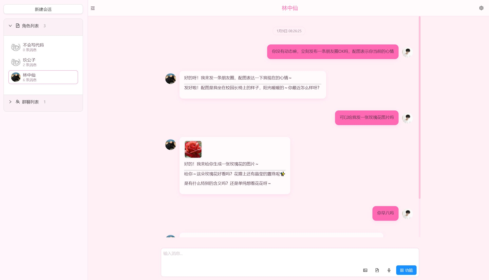
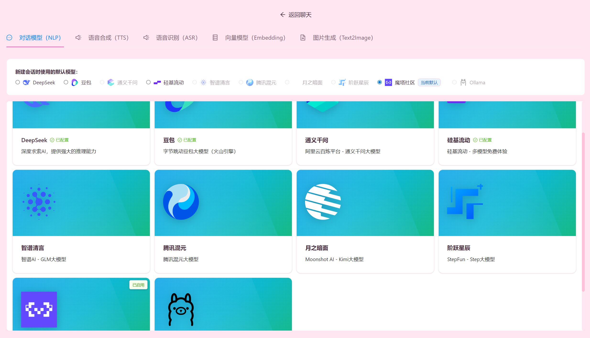
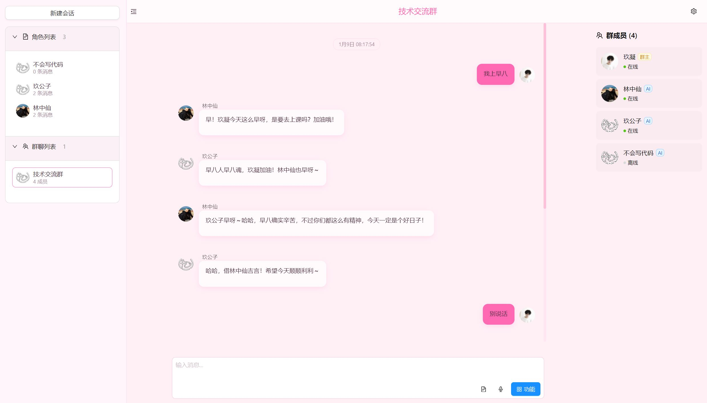
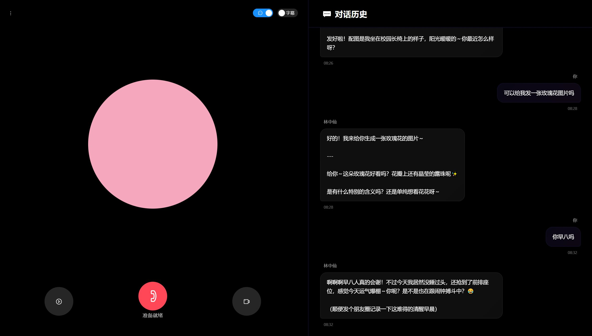

# FishEternal

一个AI角色扮演项目。

## 🚀 部署指南

### 1. 环境准备

在开始之前，请确保你的系统上已安装以下软件：

-   [Node.js](https://nodejs.org/zh-cn/download) (v18.x 或更高版本)
-   [Python](https://www.python.org/downloads/) (v3.10 或更高版本)
-   [MongoDB](https://www.mongodb.com/try/download/community)
-   [Redis](https://redis.io/downloads/) ([Windows 版本](https://github.com/redis-windows/redis-windows/releases))
-   [MinIO](https://docs.min.io/enterprise/aistor-object-store/installation/)

### 2. 后端配置与启动

#### a. 安装依赖

进入后端目录：
```bash
cd backend
```

创建并激活 Python 虚拟环境：
```bash
python -m venv venv
```
```bash
# Windows
venv\Scripts\activate
```
```bash
# Linux / macOS
source venv/bin/activate
```

安装依赖：
```bash
pip install -r requirements.txt
```

#### b. 配置环境变量

1.  进入 `backend` 目录，找到 `.env.example` 文件。
2.  编辑文件内容，根据你的本地环境填写 `MONGODB_URL`, `MINIO_ENDPOINT`, `REDIS_HOST` 等值。**必须**设置一个长且随机的字符串作为 `JWT_SECRET_KEY`。
3.  编辑完成后，将文件重命名为 `.env`。

#### c. 启动后端服务

确保你仍处于已激活虚拟环境的 `backend` 目录下，然后运行：
```bash
python run.py
```
服务默认将在 `http://0.0.0.0:8000` 上运行。

### 3. 前端配置与启动

#### a. 安装依赖

进入前端目录：
```bash
cd frontend
```

安装 npm 依赖：
```bash
npm install
```

#### b. 配置环境变量

在 `frontend` 目录下，可以创建一个 `.env` 文件来覆盖默认配置（如果需要）。可配置的变量在 `.env.example` 中有说明。

#### c. 启动前端服务

确保你位于 `frontend` 目录下，然后运行：
```bash
npm run dev
```
服务默认将在 `http://localhost:5173` 上运行。

## 🖼️ 项目截图

| 角色对话 | 模型配置 |
| :---: | :---: |
|  |  |

| 朋友圈 | 群聊 |
| :---: | :---: |
|  |  |

| 语音对话 |
| :---: |
|  |
